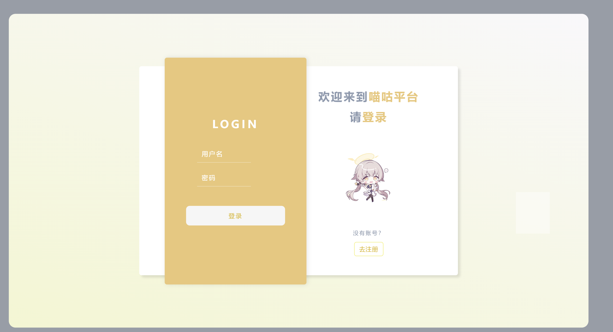
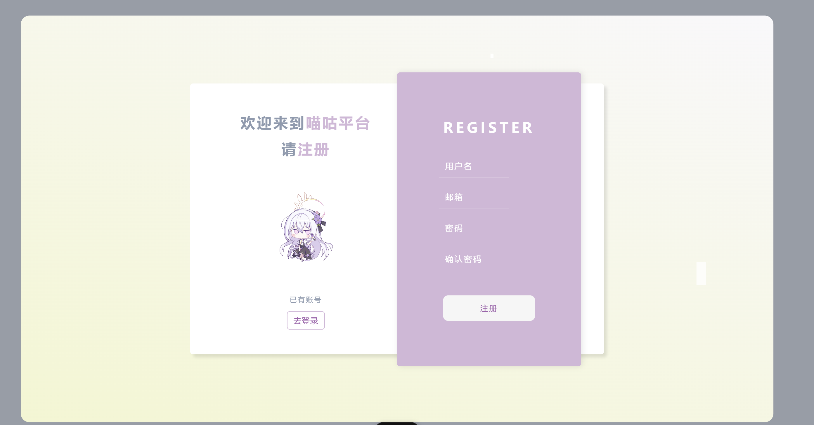

# 喵咕聊天平台前端

欢迎来到**喵咕聊天平台前端**的食用指南(≧▽≦)！这里是一个充满可爱ACG风格的AI聊天平台前端部分。

## 📝 项目简介

喵咕聊天平台前端是一个基于vite+Vue3构建的动态聊天应用程序，旨在为用户提供一个友好、灵活的聊天体验 (｡•̀ᴗ-)✧。通过与后端API的交互，用户可以轻松发送消息、获取聊天记录以及管理好友列表，尽情享受可爱的ACG氛围(*≧ω≦)！

## 🚀 技术栈

- **Vue.js**: 现代JavaScript框架，用于构建用户界面。
- **Axios**: 用于处理HTTP请求的库，方便与后端API进行交互。
- **SCSS**: CSS预处理器，增强样式表的可维护性和可读性。
- **Vue Router**: 用于管理应用程序的路由。
- **Vuex**: 状态管理库，用于管理应用的全局状态。

## 📦 安装与运行

1. **克隆项目**

   ```bash
   git clone https://github.com/hhyufan/miaogu_aichat_frontend.git
   cd miaogu_aichat
   ```

2. **安装依赖**

   使用npm安装项目依赖：

   ```bash
   npm install
   ```

3. **运行项目**

   启动开发服务器：

   ```bash
   npm run dev
   ```

   服务器启动后，你将在控制台看到类似以下的输出：

   ```
   Local:   http://localhost:5173/
   Network: use --host to expose
   ```

4. **访问应用**

   打开浏览器，访问 `http://localhost:5173/`，即可使用喵咕聊天平台前端。

## 🌟 喵咕聊天平台 功能

- **主题切换**: 切换设定颜色，丰富视觉体验。
  - **橙白主题**:
    
  - **白紫主题**:
    
- **聊天功能**: 支持发送和接收消息，查看聊天记录。
- **用户认证**: 用户可以进行注册和登录，享受个性化的聊天体验。
  - **登录**：
    
  - **注册**
    
## 📮 API 接口

前端通过Axios与后端API进行交互，以下是一些重要的API接口示例：

- **获取好友列表**: `GET /friend/friendList`
- **发送聊天消息**: `POST /{chatType}/send`
- **获取聊天记录**: `GET /{chatType}/messages`
- **清除聊天记录**: `DELETE /chat/clear`
- **用户登录**: `POST /user/login`
- **用户注册**: `POST /user/register`

## 🐾 贡献

欢迎任何形式的贡献 (๑•̀ㅂ•́)و！如果你有好的想法或发现了bug，请提交Issue或Pull Request(˘•ω•˘)◞⁽˙³˙⁾。

## 💖 感谢

感谢你对喵咕聊天平台的关注(｡・ω・｡)！希望你在这里找到乐趣，和AI小伙伴们一起畅聊吧ヽ( ^ω^ ゞ )！如果你喜欢这个项目，欢迎给我们星星⭐️！
